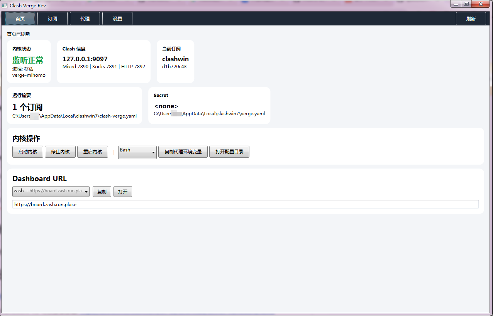
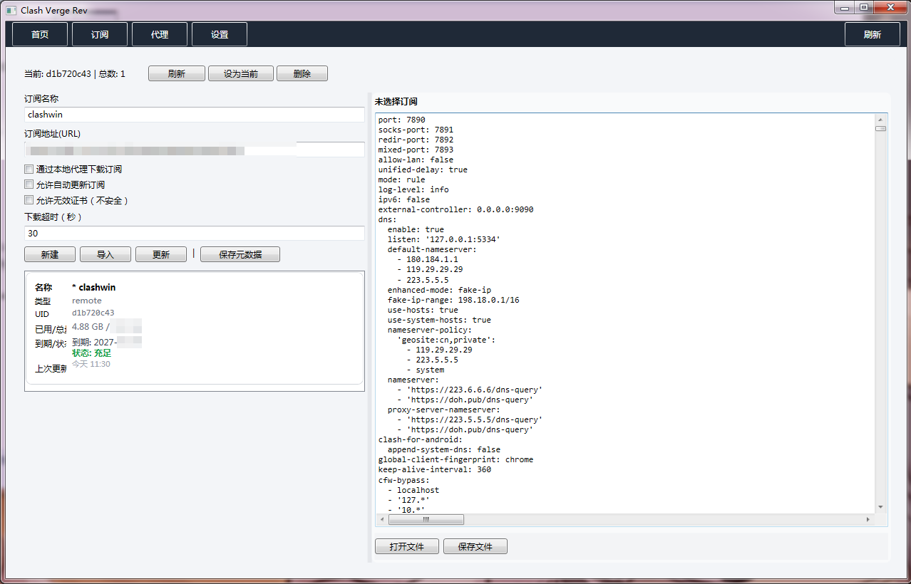

# ClashVergeCSharpVersion

Clash Verge 的 C# 简易移植版，基于 .NET Framework 4.8 打造，专为 **Windows 7** 优化。

[](LICENSE)
[](#)
[](https://dotnet.microsoft.com/download/dotnet-framework/net48)

> 原版项目：[Clash Verge Rev](https://github.com/clash-verge-rev/clash-verge-rev)

## 📋 简介

一个轻量级的 Clash 代理 GUI 客户端，使用 C# + WPF/WinForms（根据实现调整）编写。目标是提供一个简单、易用的翻墙工具，重点支持 Windows 7 系统。

**核心特性：**
- ⚡ 极简 UI，专注于功能本身
- 🪟 完美兼容 Windows 7 / Server 2008 R2+
- 📦 .NET Framework 4.8（无需额外依赖）
- 🔗 调用 Clash Core 作为底层代理引擎

## 🖼️ 截图

<table>
<tr>
<td><br>**主页面板** — 查看节点、切换规则</td>
<td><br>**订阅管理** — 添加/更新代理订阅配置</td>
</tr>
</table>

## 📦 安装依赖

本项目基于 **.NET Framework 4.8**，请确保系统已安装：

- Windows 7 SP1 / Server 2008 R2 SP1（或更高版本）
- [.NET Framework 4.8](https://dotnet.microsoft.com/en-us/download/dotnet-framework/net48)

> ⚠️ .NET 4.8 通常已预装在 Windows 7/10/11 / Server 系统上。如未安装，下载并运行上述链接即可。

## 🏗️ 构建说明

```bash
# 使用 Visual Studio 2019+（推荐）打开 .csproj 文件直接编译
# 目标框架：.NET Framework 4.8

# 或命令行方式
msbuild yourproject.csproj /p:Configuration=Release
```

## 📝 更新日志

### v2.0
- 修改了界面布局与交互逻辑
- 新增默认 GeoSite 配置，避免内核启动时报错

## ❓ FAQ

**Q: Windows 7 上可以运行吗？**  
A: 可以。这是本项目的核心设计目标之一。确保已安装 .NET Framework 4.8。

**Q: Clash Core 需要额外下载吗？**  
A: 根据实现方式，可能需要自行放置 Clash 二进制文件到指定目录（配置说明见项目代码）。

## 📄 License

[MIT License](LICENSE) — 开源自由使用、修改和分发。

---

> 💡 **Note**: 本项目为 AI 辅助编写的个人用工具，代码结构简单明了，欢迎 Fork & Star！
